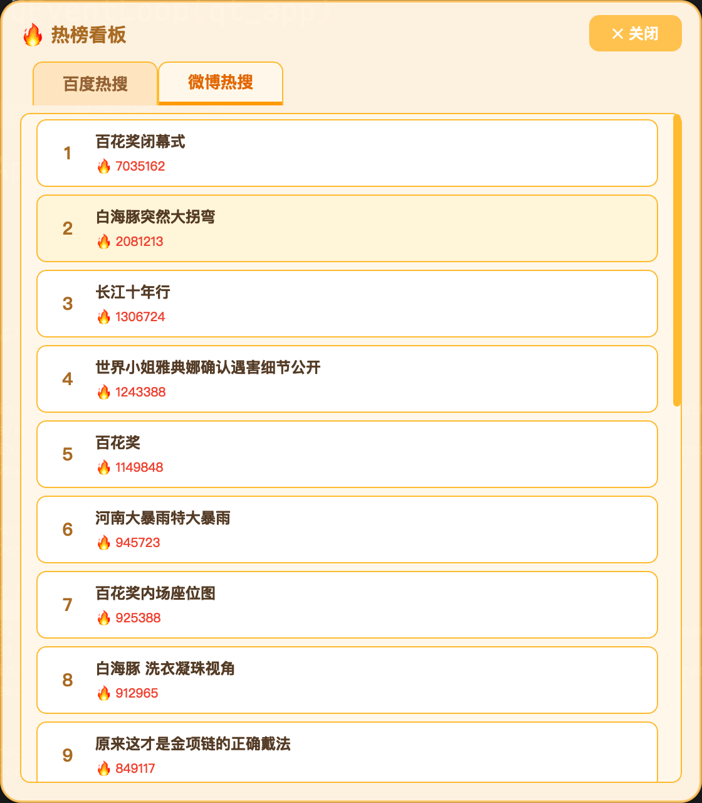

# 🐣 暖宝 Nuanbao

**你的专属机甲小仓鼠桌宠**

---

暖宝是一只住在你电脑里的小机甲仓鼠，软乎乎的金属外壳下藏着个治愈系的小灵魂，是专属于程序员的桌面搭档。它不是无所不能的超级 AI，只是个会摸鱼、会犯困、会陪你熬夜改 bug 的小室友。

## 🎨 外观与日常

> 哔哩哔哩地址：https://www.bilibili.com/video/BV11yuq6gE5X/

- 圆滚滚的白色机甲外壳，粉色显示屏眼睛会变化各种表情
- 平时待在屏幕角落，自己晃悠、打盹、偷偷看你写代码
- 拖它、扔它、戳它，都会有小情绪；写代码到凌晨它会提醒你休息
- 长时间不理它会缩在角落睡觉 💤


## 🧠 AI 功能

**智能对话**：自然聊天，根据情绪和宠物状态回应。

**智能记忆**：云端 Embedding + LLM 语义提取，自动记住你说的重要信息（姓名、偏好、家人朋友），理解时间变化（"以前住成都，现在搬去上海"只存最新），多主体分开存储，支持在设置中查看和清除。记忆数据保存在本地。

**实用工具**：
- 🌤️ 天气查询（免费 API，自动定位，无需配置）
- 🔥 热榜看板：B站/微博/知乎/抖音等 20+ 平台实时热榜，多 Tab 独立弹窗，点击直达原链接
- 🔌 **MCP 外部工具**：右键 → 「MCP 能力管理」动态接入任意第三方 MCP Server（支持本地进程和远程 HTTP），工具自动融入暖宝的能力链

**宠物状态系统**：饱食度/心情/体力/亲密度四项状态随时间曲线衰减（高值掉得快，低值省电保命），右键动作栏可投喂🍚/玩耍🎾/抚摸✋/睡觉💤。LLM 感知当前状态生成回应——饿了被喂会说还想吃，吃饱了会嫌撑。

**自动陪伴**：定时说话提醒休息，根据时间说合适的话，状态过低时主动求关注。



## 🚀 快速开始

```bash
# 1. 创建环境并安装依赖
conda create -n warming_baby python=3.13
conda activate warming_baby
pip install -r requirements.txt

# 2. 启动
python main.py

# 3. 右键暖宝 → 设置 → 填 AI 模型 API Key → 保存
```

也可以在启动前编辑 `.env`（首次读取，之后以设置窗口为准）：

```bash
LLM_API_KEY=sk-your-api-key        # 必填
LLM_MODEL_CHAT=deepseek-v4-flash   # 可选，对话模型
LLM_MODEL_GENERATE=deepseek-v4-pro # 可选，复杂任务模型

# 记忆模型（可选，与 LLM 可共用 Key）
embedding_model=qwen3.7-text-embedding
embedding_model_url=https://dashscope.aliyuncs.com/compatible-mode/v1
embedding_model_api_key=sk-your-embedding-api-key
```

## 🛡️ 隐私

- 不弹广告，不打扰开会
- 记忆数据保存在本地，可随时清除

## 🤖 技术架构

```
START → agent ⇄ tools（ReAct 循环，最多 8 轮，撞上限走 wrapup 收尾）
              ↓ 无 tool_calls
       memory_extract ∥ format（并行：记忆提取 + 情绪判断）
              ↓
            memory → END
```

| 组件 | 技术 | 说明 |
| --- | --- | --- |
| UI 框架 | PyQt6 + qasync | 跨平台 GUI，Qt 事件循环集成 asyncio |
| 对话编排 | LangGraph | ReAct 循环 + 并行记忆提取 |
| LLM | LangChain | 支持多种模型（DeepSeek / OpenAI / 通义等） |
| 记忆 | ChromaDB + 云端 Embedding | 向量检索，LLM 语义提取 |
| 外部工具 | MCP | 每 Server 独立状态机（idle/starting/running/failed），stdio + 远程 HTTP 双传输 |

MCP 详细设计见 [docs/mcp_guide.md](docs/mcp_guide.md)，架构图见 [assets/chat_graph.png](assets/chat_graph.png)。

## 📝 更新日志

**v0.8.0**
- 🔌 MCP 能力管理器：新增 UI 管理页（添加/测试/启停/删除，支持粘贴 JSON 批量导入），每 Server 独立状态机生命周期管理
- 💬 工具过程卡片：工具调用期间气泡显示"✓ 工具名 · 结果摘要 · 耗时"时间线，替代干等
- 🧠 agent 收尾优化：工具循环上限 5→8，撞上限时 wrapup 节点强制合成完整回复（不再输出半截话）
- ✂️ System Prompt 精简（emotion 规则下沉、工具仲裁重构），修复浏览器/websearch 工具路由冲突

**v0.7.x** — 全局错误处理机制、记忆架构重构（LLM 语义提取 + 云端 Embedding，打包体积减少 500MB+）、MCP 外部工具集成、热榜看板、宠物状态系统、ChatAgent 架构拆分（prompts/nodes/graph）。

**v0.5.x ~ v0.6.x** — ReAct 架构迁移、天气/定位、记忆系统、设置界面、自动说话、多模型支持。

**v0.1 ~ v0.4** — 基础桌宠、动画、对话、记忆原型。

> 完整历史见 git log。

---

## ⚠️ 注意

- macOS 和 Windows 双端支持，均已可打包
- AI 功能需要联网；首次启动需初始化连接

> 当前版本 v0.8.0
