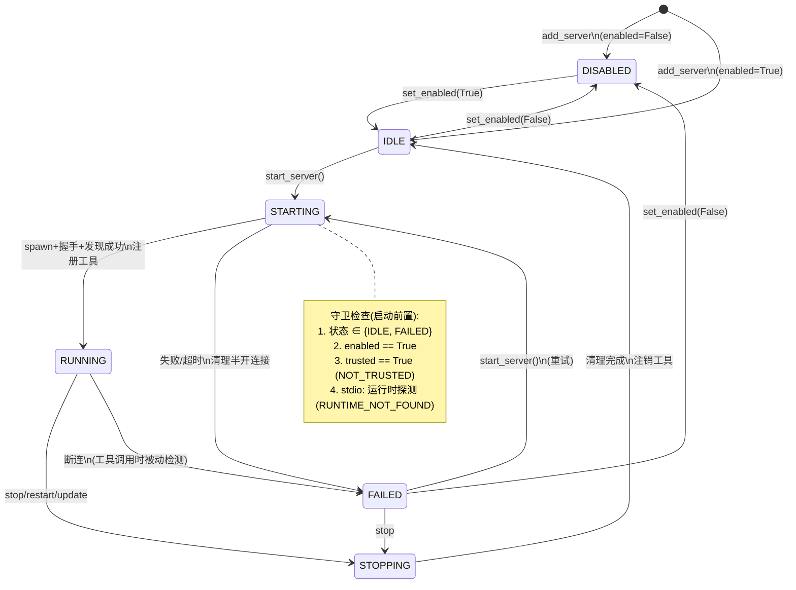

# 暖宝 MCP 集成教学文档

> 适用读者：想理解 MCP 协议原理、以及暖宝桌宠如何接入 MCP 工具生态的开发者

---

## 第 1 章 什么是 MCP

### 1.1 一句话理解

**MCP（Model Context Protocol）是 AI Agent 跟外部世界交换"能力"的开放协议。**

它的角色类似 USB：大模型（Agent）是电脑主机，外部数据源 / 第三方工具是 U 盘 / 鼠标 / 打印机。没有 MCP 时，你得为每种外设写定制驱动；有了 MCP，就像 USB 标准化了接口，只要设备支持 USB，插上就能用。

### 1.2 为什么需要它（痛点）

在 MCP 出现之前，LLM 接工具的模式是：**每个工具都要手写一段代码**。

```python
# 传统模式：每个工具写一份代码
def bing_search(query: str) -> str:
    url = "https://api.bing.com/v7/search?q=" + query
    resp = requests.get(url, headers={"Ocp-Apim-Subscription-Key": KEY})
    ...
```

问题：

1. **重复造轮子**：换个应用（从桌宠改到聊天机器人），bing_search 又写一次
2. **版本不共享**：有人写了新版 Bing MCP Server，旧代码得手动迁移
3. **权限分发难**：API KEY 散落在各处，难管理

MCP 解决了这些：

```
LLM Agent (桌宠)
    │
    └── MCP Client（标准协议）── stdio / HTTP ── MCP Server (bing-cn-mcp)
                                                   │
                                                   └── 调用 Bing API
```

- **写一次，到处接**：任何兼容 MCP Client 的应用都能连同一个 MCP Server
- **生态共享**：社区在 [modelcontextprotocol/servers](https://github.com/modelcontextprotocol/servers) 提供了几十种 Server（GitHub、Gmail、Notion、Slack……）
- **协议无关传输**：可以走 stdio（子进程管道）、HTTP/SSE、WebSocket

### 1.3 MCP 在协议分层的位置

```
Layer 3     LangGraph / LangChain（Agent 编排层）
                    │ bind_tools() / ainvoke()
Layer 2     MCP SDK（ClientSession / 类型定义）
                    │ initialize / list_tools / call_tool
Layer 1     JSON-RPC（序列化层）─ stdout/stdin 或 HTTP POST
```

MCP 的协议体是 JSON-RPC 2.0，所以本质上就是 LLM 和工具之间用 JSON 发消息。

---

## 第 2 章 MCP 连接过程（协议视角）

MCP 客户端连上一个 Server 后，严格按 4 步走：

### Step 1. 建 Transport（建立通信管道）

两种主流 Transport：

| Transport             | 适用场景                                                    | 工作原理                                                      |
| --------------------- | ----------------------------------------------------------- | ------------------------------------------------------------- |
| **stdio**             | Server 和 Client 在同一台机器，随 Client 启动 Server 子进程 | `spawn(cmd)` → `stdin` / `stdout` 双向管道，每行一条 JSON-RPC |
| **HTTP/SSE (remote)** | Server 跑在其他机器 / Docker / 云                           | Client 发 `POST` 调用，Server 推事件用 `SSE`                  |

stdio 是最常用的，你在本机上装 Claude Desktop / 桌宠应用，Server 就以子进程方式启动。

### Step 2. Initialize 握手

```
Client → {"jsonrpc":"2.0","method":"initialize","params":{"protocolVersion":"...","capabilities":{...},"clientInfo":{...}}}
Server → {"result":{"protocolVersion":"...","capabilities":{...},"serverInfo":{...}}}
Client → {"method":"notifications/initialized"}
```

- 客户端报自己是谁、支持哪些 capability
- 服务端回自己支持什么：`tools`, `resources`, `prompts` 三选一或全有
- 客户端再确认"我知道了"（通知，无需响应）

### Step 3. 发现阶段（Discovery）

客户端按需拉取 Server 暴露的内容：

```
Client → {"method":"tools/list"}
Server → {"result":{"tools":[
  {"name":"bing_search","description":"国内版必应搜索","inputSchema":{"type":"object","properties":{"query":{"type":"string"}}}}
]}}
```

`tools/list` → 返回工具列表（本项目用的主要能力）
`resources/list` → 返回可读资源（如代码库、数据库）
`prompts/list` → 返回预定义 Prompt 模板

### Step 4. 使用阶段（调用 / 订阅）

最核心的调用是 `tools/call`：

```
Client → {"method":"tools/call","params":{"name":"bing_search","arguments":{"query":"成都天气"}}}
Server → {"result":{"content":[{"type":"text","text":"成都 28°C 晴..."}]}}
```

完成后，应用退出前发送 `shutdown` 通知并断开管道。

### 完整时序图

```
        Client (桌宠)                                Server (bing-cn-mcp)
             │                                                │
 ──1──spawn──▶│                                                │
             │     ═══ stdio 管道 ═══                          │
             │──initialize───────────────────────────────────▶│
             │◀──initialize result────────────────────────────│
             │──notifications/initialized────────────────────▶│
             │                                                │
 ──2──握手──▶│                                                │
             │──tools/list───────────────────────────────────▶│
             │◀──[{name:"bing_search", ...}]──────────────────│
             │                                                │
 ──3──发现──▶│                                                │
             │                                                │
             │  LLM 决定调用 bing_search("成都天气")           │
             │──tools/call──┐                                 │
             │              │  arguments={"query":"成都天气"} │
             │              └────────────────────────────────▶│
             │◀──result.content=[{type:"text", text:"..."}]───│
             │                                                │
 ──4──调用──▶│                                                │
             │                  ...                            │
             │──shutdown notification────────────────────────▶│
             │──close stdio ──▶  (子进程退出)                  │
```

---

## 第 3 章 stdio 模式 vs remote（SSE/HTTP）模式

### 3.1 stdio（子进程管道）模式

#### 原理

```
桌宠进程（Python）
    │
    ├── os.spawn("npx -y bing-cn-mcp")
    │
    └── 管道 fd：
          ┌─── stdin write → 子进程 stdin
          └── stdout read  ← 子进程 stdout
```

- Client 用 Python 的 `asyncio.create_subprocess_exec(cmd, *args, stdin=PIPE, stdout=PIPE)` 创建子进程
- 子进程（`npx → node → bing-cn-mcp`）读 stdin 的 JSON-RPC 请求，把 JSON-RPC 响应写回 stdout
- **子进程生命周期严格绑定 Client**：Client 死 → 进程组收到 SIGTERM → Server 退出

#### 优点

- 零配置，**Server 地址就是命令行 + args**
- 天然隔离，权限按当前用户
- 部署简单：本地装一下 `npx` 就行

#### 缺点

- **只能本机**，Server 必须在当前系统
- 多个 Server 会占多条进程（你桌宠配置 3 个 MCP，就有 3 组 npx/node 进程）
- Windows 上 `.cmd` / `.bat` 脚本启动 MCP 有时会遇到 spawn 找不到的问题（本项目在 Windows 上用 `cmd /c npx` 规避）

#### 关键代码

本项目 stdio 模式实现在 [mcp_client.py#L131-L196](file:///Users/yangchengwei/Documents/workspace/github_workspace/my_baby/warming_baby/tools/mcp/mcp_client.py#L131-L196)

```python
server_params = StdioServerParameters(
    command="npx", args=["-y", "bing-cn-mcp"], encoding="utf-8",
)

# 1) 启动子进程，拿到 read/write 两个流 (asyncio StreamReader/Writer)
ctx = stdio_client(server_params)
read, write = await ctx.__aenter__()

# 2) 在这两个流上跑 JSON-RPC
session_ctx = ClientSession(read, write)
session = await session_ctx.__aenter__()

# 3) 握手 + 拉工具
await session.initialize()
tools = (await session.list_tools()).tools
```

### 3.2 Remote 模式（HTTP + SSE）

#### 原理

```
 ┌────────────── 机器 A ─────────────┐     ┌──────── 机器 B ──────────┐
 │  桌宠                             │     │   MCP Server (容器部署)   │
 │  MCP Client (SDK)                 │     │   (标准 python-mcp sdk)   │
 │                                   │     │                           │
 │   POST /message   ── HTTPS ───────┼────▶│  路由 → dispatch JSONRPC │
 │   SSE /sse       ◀── 事件流 ──────┼─────┤  发事件通知              │
 └───────────────────────────────────┘     └───────────────────────────┘
```

- Client 用 HTTP `POST` 发 JSON-RPC 到 Server 提供的 endpoint
- Server 用 **SSE（Server-Sent Events）** 推异步通知（比如资源更新、日志、进度）
- Server 由运维部署，**生命周期和 Client 无关**

#### 优点

- **跨机器**：Server 跑在 Docker / k8s / 云服务器，桌面应用远程连接
- **集中管理**：一个公司部署一个 GitHub MCP Server，所有员工桌宠都能用同一个
- **权限集中**：API KEY 只放在 Server 容器里，客户端不需要知道

#### 缺点

- 比 stdio 部署复杂：需要 HTTPS 证书、身份验证、SSE endpoint
- **Client 不在线时 Server 会继续活着**（反而可以让多 Client 共享同一台 Server）

#### Python-mcp 快速部署 remote

```python
# 例子: remote_server.py (本项目未使用，仅供对比理解)
from mcp.server.fastmcp import FastMCP

mcp = FastMCP("demo")

@mcp.tool()
def add(a: int, b: int) -> int:
    return a + b

if __name__ == "__main__":
    mcp.run(transport="sse", host="0.0.0.0", port=8000)
```

本项目当前所有 MCP Server 用的都是 **stdio 模式**，remote 模式放在这里是帮你建立完整认知。

---

## 第 4 章 暖宝项目的 MCP 架构（深入源码）

### 4.1 模块地图

```
tools/mcp/
├── __init__.py          # 对外导出：mcp_client_manager / Schema / parse_claude_config
├── mcp_schema.py        # 配置与状态 Schema（stdio/remote 判别联合 + 状态机枚举 + 错误码）
├── mcp_store.py         # mcp_servers.json 读写 + Claude Desktop JSON 批量导入
├── runtime_detect.py    # stdio 运行时探测（npx/node 三层探测，解决 GUI 进程 PATH 问题）
├── mcp_client.py        # MCPClientManager：按 server 粒度的状态机管理器
└── mcp_bridge.py        # McpToolWrapper：MCP Tool → LangChain AgentTool 桥接器

tools/tool_base.py       # AgentTool 基类 + ToolRegistry（register/unregister）
agent/chat/graph.py      # ChatGraph：bind_tools() 把 MCP 工具也绑给 LLM
agent/chat/nodes.py      # CustomToolNode：执行工具调用
agent/chat/chat_agent.py # 订阅 MCP_SERVER_STATE 事件 → 工具集变化时丢弃 ChatGraph 缓存
app.py                   # 启动入口：warmup 阶段调 load() + start_all()，退出调 shutdown_all()
```

### 4.2 配置层：`MCP_SERVERS` 字典（mcp_config.py）

配置完全仿照 **Claude Desktop** 的 `claude_desktop_config.json`，这样如果哪天你想在 Claude Desktop 里用同一个 MCP Server，直接复制粘贴就行：

```python
MCP_SERVERS = {
    "bing-search": {
        "command": "npx",
        "args": ["-y", "bing-cn-mcp"],
        "enabled": True,
    },
}
```

跨平台处理在 [mcp_config.py#L41-L43](file:///Users/yangchengwei/Documents/workspace/github_workspace/my_baby/warming_baby/tools/mcp/mcp_config.py#L41-L43)：

```python
if IS_WINDOWS:
    MCP_SERVERS["bing-search"]["command"] = "cmd"
    MCP_SERVERS["bing-search"]["args"] = ["/c", "npx", "-y", "bing-cn-mcp"]
```

Windows 下 Python 的 subprocess 有时无法直接 spawn `.cmd` 文件（它是脚本不是可执行文件），所以绕一层 `cmd.exe /c` 让命令解释器执行。

### 4.3 生命周期管理器：`MCPClientManager`（mcp_client.py）

这是 MCP 接入的"大管家"。

#### 启动流程（`start()` → `_start_server()`）

```
 start()
   │
   ├── 遍历 MCP_SERVERS.items()
   │     enabled=False 的跳过
   │
   └── 对每个 Server 调 _start_server(server_name, config):
         │
         ├─ 1. _resolve_command(config["command"])
         │       macOS/Linux → 原样返回
         │       Windows     → shutil.which 找 .cmd/.bat/.exe/.ps1 后缀
         │
         ├─ 2. stdio_client(server_params)
         │       spawn 子进程，返回 (read_stream, write_stream)
         │
         ├─ 3. ClientSession(read, write).__aenter__()
         │       建立 JSON-RPC 会话
         │
         ├─ 4. session.initialize()         ← 协议 Step 2
         │
         ├─ 5. session.list_tools()         ← 协议 Step 3
         │       拿到 [Tool(name, description, input_schema)]
         │
         ├─ 6. 对每个 tool:
         │       McpToolWrapper.from_mcp_tool(session, mcp_tool, server_name)
         │       tool_registry.register(wrapper)
         │
         └─ 7. self._sessions[server_name] = session
                保存，后面 shutdown 会关它
```

核心代码在 [mcp_client.py#L131-L196](file:///Users/yangchengwei/Documents/workspace/github_workspace/my_baby/warming_baby/tools/mcp/mcp_client.py#L131-L196)

#### 关闭流程（`shutdown()`）

- `self._cleanup_funcs` 存了 2 个清理函数 per Server：先关 `ClientSession`，再关 `stdio_client`（对应 2 层 async context manager）
- 用 `reversed()` 逆序执行（和进栈顺序相反）
- **Windows 兜底**：`taskkill /F /T` 按进程名清 npx/node 僵尸进程。因为 Windows 上 `process.kill()` 只杀父进程不递归，`npx → node → bing-cn-mcp` 的进程链可能留下子进程。

代码在 [mcp_client.py#L198-L273](file:///Users/yangchengwei/Documents/workspace/github_workspace/my_baby/warming_baby/tools/mcp/mcp_client.py#L198-L273)

#### 启动时机（app.py）

在"热身阶段"异步启动，**不阻塞宠物 UI**：

```python
# app.py L235-238
from tools.mcp import mcp_client_manager
mcp_tool_count = await mcp_client_manager.start()
if mcp_tool_count > 0:
    logger.info(f"[Warmup] MCP tools registered: {mcp_tool_count}")
```

同时在应用关闭钩子中调用 `mcp_client_manager.shutdown()`，保证 Server 子进程不会成为僵尸进程。

### 4.4 桥接器：`McpToolWrapper`（mcp_bridge.py）

**最关键的设计**。MCP SDK 返回的 Tool 对象和 LangChain 的 `BaseTool` 是两套接口，不能直接给 `bind_tools()` 用。`McpToolWrapper` 就是"转接头"。

```
┌──────── MCP 世界 ────────┐      ┌──────── LangChain 世界 ───────┐
│ Tool {                  │      │ AgentTool (LangChain BaseTool) │
│   name: "bing_search",  │ ────▶│   name: "bing_search"         │
│   description: "...",   │      │   description: "..."          │
│   input_schema: {       │      │   args_schema: BingSearchArgs │
│     type:"object",      │      │                               │
│     properties:{...}    │      │   async _execute(**kwargs) {  │
│   }                     │      │     session.call_tool(...)    │
│ }                        │      │   }                           │
└─────────────────────────┘      └──────────────────────────────┘
```

#### 4.4.1 JSON Schema → Pydantic Model 转换

MCP 用 JSON Schema 描述参数（通用协议），LangChain 需要 Pydantic 模型（Python 类型系统）。转换函数是 `_json_schema_to_pydantic`：

```python
_JSON_TYPE_MAP = {
    "string": str, "integer": int, "number": float,
    "boolean": bool, "array": list, "object": dict,
}

fields = {}
for prop_name, prop_def in properties.items():
    json_type = prop_def.get("type", "string")
    py_type = _JSON_TYPE_MAP.get(json_type, str)
    description = prop_def.get("description", "")

    if prop_name in required:
        fields[prop_name] = (py_type, Field(..., description=description))
    else:
        fields[prop_name] = (Optional[py_type], Field(default=default, description=description))

return create_model(f"{tool_name}_Args", __base__=BaseToolArgs, **fields)
```

关键点：

- `pydantic.create_model()` 动态生成类名，比如 `bing_search_Args`
- **保留 description**：LLM 依赖这个字段判断工具怎么选、怎么填参数。MCP 里写的中文描述会直接透传给 Agent
- 区分 required/optional：必填字段用 `...` (Ellipsis) 做 default，可选给默认值

#### 4.4.2 `_execute()`：真正调用到 MCP Server

```python
async def _execute(self, **kwargs):
    result = await self._session.call_tool(self._mcp_name, filtered_args)
    texts = [content.text for content in result.content if hasattr(content, "text")]
    return "\n".join(texts) if texts else "（无返回内容）"
```

- `_session` 是存下来的 `ClientSession`（从 `from_mcp_tool` 构造时写入，Python 私有属性不参与 Pydantic 序列化）
- `_mcp_name` 是 MCP 工具原名（一般和 wrapper.name 一致，但保留原始字段保险）
- **过滤 None**：`filtered_args = {k: v for k, v in kwargs.items() if v is not None}` 避免把 LLM 没填的可选参数传给 Server
- 返回内容 **只取 text 类型**。MCP 还支持 `image` / `embedded_resource` 等，目前暖宝桌宠的 LLM Agent 只处理文本。

### 4.5 注册 & 调用链：MCP → ToolRegistry → LangGraph

一张图串起所有模块：

```
   启动阶段 (warmup)
   ───────────────────────────────────────────────
   app.py
      └─ mcp_client_manager.start()
            └─ for 每个 MCP Server:
                 ├─ spawn + initialize + list_tools
                 └─ McpToolWrapper.from_mcp_tool(...)
                         ▼
                 tool_registry.register(wrapper)    ─── 每个 MCP 工具登记入册

   对话阶段 (chat)
   ───────────────────────────────────────────────
   agent/chat/graph.py _build_graph():
      ├─ tools = tool_registry.get_tools()  ───── 从注册表拉所有工具（含 MCP）
      ├─ bound_llm = llm.bind_tools(tools)   ───── LLM 学会这些工具
      └─ CustomToolNode(tools)               ───── 建一个"工具执行节点"

   LLM 推理阶段：
   ───────────────────────────────────────────────
   LLM 生成 tool_calls:
       [{"name":"bing_search","args":{"query":"成都"},"id":"call_abc"}]
                      │
                      ▼
   CustomToolNode.__call__():
       for tool_call in message.tool_calls:
           tool = self.tools_by_name[tool_call["name"]]  ← McpToolWrapper 实例
           result = await tool.ainvoke(tool_call["args"])
                          │
                          ├── McpToolWrapper._arun()  (AgentTool 基类打日志)
                          │       │
                          │       ▼
                          └── McpToolWrapper._execute()
                                   │
                                   └── session.call_tool("bing_search", {"query":"成都"})
                                                   │
                                                   └── JSON-RPC via stdio
                                                                  │
                                                                  ▼
                                               bing-cn-mcp Server 返回内容
                                                   │
                                                   ▼
                                   result.content → 组装 ToolMessage
                                                   │
                                                   ▼
                                           进入下一轮 LLM 迭代
```

对照源码：

- 注册：[mcp_client.py#L187-L192](file:///Users/yangchengwei/Documents/workspace/github_workspace/my_baby/warming_baby/tools/mcp/mcp_client.py#L187-L192)
- 工具列表读取给 LangGraph：[graph.py#L63](file:///Users/yangchengwei/Documents/workspace/github_workspace/my_baby/warming_baby/agent/chat/graph.py#L63)
- LLM `bind_tools()`：[graph.py#L93](file:///Users/yangchengwei/Documents/workspace/github_workspace/my_baby/warming_baby/agent/chat/graph.py#L93)
- CustomToolNode 执行 `tool.ainvoke()`：[nodes.py#L280-L284](file:///Users/yangchengwei/Documents/workspace/github_workspace/my_baby/warming_baby/agent/chat/nodes.py#L280-L284)

### 4.6 错误容忍策略（设计亮点）

本项目的 MCP 接入在几个地方做了容错，避免第三方 Server 挂了把桌宠一起带崩：

| 位置                        | 策略                                                                                      | 源码                                                                                                                                              |
| --------------------------- | ----------------------------------------------------------------------------------------- | ------------------------------------------------------------------------------------------------------------------------------------------------- |
| `MCPClientManager.start()`  | 单个 Server 启动失败 → `logger.warning`，**不影响其它 Server**                            | [mcp_client.py#L124-L126](file:///Users/yangchengwei/Documents/workspace/github_workspace/my_baby/warming_baby/tools/mcp/mcp_client.py#L124-L126) |
| 单个工具注册失败            | 只跳过那个工具，其它工具继续注册                                                          | [mcp_client.py#L191-L192](file:///Users/yangchengwei/Documents/workspace/github_workspace/my_baby/warming_baby/tools/mcp/mcp_client.py#L191-L192) |
| `_kill_orphan_servers()`    | Windows 退出时用 `taskkill /F /T` 清僵尸进程                                              | [mcp_client.py#L221-L273](file:///Users/yangchengwei/Documents/workspace/github_workspace/my_baby/warming_baby/tools/mcp/mcp_client.py#L221-L273) |
| `McpToolWrapper._execute()` | `session not initialized` → `raise RuntimeError`，上层 CustomToolNode `except` 打日志继续 | [mcp_bridge.py#L131-L132](file:///Users/yangchengwei/Documents/workspace/github_workspace/my_baby/warming_baby/tools/mcp/mcp_bridge.py#L131-L132) |

---

## 第 5 章 动手：给自己加一个 MCP Server

以加 `@modelcontextprotocol/server-fetch` 为例（它能让 LLM 抓取任意网页内容）。

### Step 1：改 mcp_config.py

```python
MCP_SERVERS = {
    "bing-search": {
        "command": "npx",
        "args": ["-y", "bing-cn-mcp"],
        "enabled": True,
    },
    # + 新增
    "fetch": {
        "command": "npx",
        "args": ["-y", "@modelcontextprotocol/server-fetch"],
        "enabled": True,
    },
}

# 别忘了 Windows 也加一份
if IS_WINDOWS:
    MCP_SERVERS["bing-search"]["command"] = "cmd"
    MCP_SERVERS["bing-search"]["args"] = ["/c", "npx", "-y", "bing-cn-mcp"]
    MCP_SERVERS["fetch"]["command"] = "cmd"
    MCP_SERVERS["fetch"]["args"] = ["/c", "npx", "-y", "@modelcontextprotocol/server-fetch"]
```

### Step 2：跑起来验证

启动桌宠，看日志：

```
[MCPClient] 正在启动 Server: fetch (npx -y @modelcontextprotocol/server-fetch)
[MCPClient] Server 'fetch' 连接成功
[MCPClient] Server 'fetch' 暴露 2 个工具
[McpBridge] 包装工具: fetch_page (from fetch, args: ['url'])
[McpBridge] 包装工具: fetch_search (from fetch, args: ['query'])
[ToolRegistry] 注册: fetch_page
[ToolRegistry] 注册: fetch_search
[MCPClient] 启动完成: 2 个 Server, 4 个工具
```

### Step 3：跟暖宝说

"帮我看看 https://example.com 写了什么"

LLM 会自动识别有 `fetch_page` 可用，发 tool call → MCP 子进程调用 node → 返回网页内容 → LLM 总结给你。

---

## 第 6 章 常见问题 FAQ

**Q1: 启动日志里 `Server 'xxx' 启动失败`？**

A: 按顺序查：

1. `which npx` 有没有，没装 Node.js → 装 LTS
2. Windows 下 `npx.cmd` 是否在 PATH，或看报错里的"未在 PATH 中找到"
3. 防火墙 / 代理是否允许 `npx -y <包名>` 下载首次安装
4. 单独跑一下命令，看是否有交互式提示：
   ```bash
   npx -y bing-cn-mcp   # ctrl+C 退出
   ```

**Q2: 启动成功但 LLM 不调用 MCP 工具？**

A: 常见三类原因：

1. 工具 description 写得太短，LLM 不知道什么时候用。在 MCP Server 那边增加 description。
2. 暖宝的 system prompt 可能没暗示工具能力 → 看 [prompts.py](file:///Users/yangchengwei/Documents/workspace/github_workspace/my_baby/warming_baby/agent/chat/prompts.py) 但通常 LangGraph bind_tools 后 LLM 会自己识别。
3. **MCP 工具在 ChatGraph 构建后才注册**：启动顺序错误，要保证 `mcp_client_manager.start()` 在 `_build_graph()` 之前跑（本项目是对的，warmup 顺序先 MCP 后 graph prebuilt）。

**Q3: Mac 上 MCP 正常，Windows 上报中文乱码？**

A: 本项目在 `StdioServerParameters(encoding="utf-8", encoding_error_handler="replace")` 已经处理。Windows 上如果仍乱码，查：

- `chcp 65001` 是否已设（控制台 UTF-8）
- 或改用 remote 模式（HTTP 传输无编码问题）

**Q4: 怎么知道 McpToolWrapper 真正调了 Server？**

A: 看 `logs/api_service.log`：

```
[Tool] bing_search: {'query': '成都天气'}        ← CustomToolNode 进入
...
[Tool] bing_search 完成                         ← session.call_tool 返回了
```

如果"进入"但很久不"完成"，一般是 MCP Server 子进程卡住或在联网请求，`timeout` 默认 30s（由 MCP SDK 控制）。

**Q5: 为什么 Mac / Windows 打包后 MCP 能工作？有没有 PyInstaller 注意点？**

A: 本项目 MCP 依赖的是 `mcp==2.0.0`（纯 Python，没 C 扩展），打包相对容易。注意点：

1. `requirements.txt` 一定要包含 `mcp==2.0.0`
2. build_mac/build_win 的 hiddenimports 里如果用了 `langchain_openai` 也会间接拉 HTTP 客户端库，MCP 走 stdio 不需要额外网络 C 扩展。
3. 如果打包后 Server 启动失败，往往是 `npx` 不在 PATH。桌宠的 PATH 继承自启动 session，Windows 装 Node 时要勾选"加入 PATH"。

---

## 第 7 章 Server 生命周期状态机（v0.7.2+ 动态加载架构）

自动态加载重构起，每个 MCP Server 拥有一条独立的状态机（定义在
[mcp_schema.py](file:///Users/yangchengwei/Documents/workspace/github_workspace/my_baby/warming_baby/tools/mcp/mcp_schema.py)，
执行在 [mcp_client.py](file:///Users/yangchengwei/Documents/workspace/github_workspace/my_baby/warming_baby/tools/mcp/mcp_client.py)）。

### 7.1 状态总览

| 状态       | 含义                                                   | 工具可见性                       |
| ---------- | ------------------------------------------------------ | -------------------------------- |
| `DISABLED` | 已配置但被禁用（`enabled=False`），禁止启动            | 未注册                           |
| `IDLE`     | 已启用，未运行                                         | 未注册                           |
| `STARTING` | 启动中（spawn + 握手 + 工具发现，stdio 默认 20s 超时） | 未注册                           |
| `RUNNING`  | 运行中，工具已注册进 tool_registry                     | 已注册（`{server}_{tool}` 前缀） |
| `STOPPING` | 停止中（注销工具 + 关闭连接）                          | 已注销                           |
| `FAILED`   | 启动失败或运行中断连，可重试                           | 已注销                           |

### 7.2 状态转移图

```
                     add_server()
        (新配置) ──────────────────────┐
             │ enabled=True            │ enabled=False
             ▼                         ▼
           ┌──────┐   set_enabled(True)  ┌──────────┐
     ┌────►│ IDLE │◄────────────────────│ DISABLED │
     │     └──┬───┘   set_enabled(False) └────▲─────┘
     │        │ start_server()                │（先 stop 再禁用）
     │        ▼                               │
     │   ┌──────────┐  成功: 注册工具    ┌────┴─────┐
     │   │STARTING  │──────────────► ┌──┤ RUNNING  │
     │   └────┬─────┘                │  └────┬─────┘
     │        │ 失败/超时             │       │ stop/restart
     │        ▼                      │       ▼
     │   ┌──────────┐   start(重试)  │  ┌──────────┐
     │   │ FAILED   │────────────────┘  │STOPPING  │
     │   └────┬─────┘                   └────┬─────┘
     │        │ 运行中断连 → FAILED（自动）  │ 清理完成
     └────────┘                              │
      （FAILED 也可直接 stop → IDLE）         ▼
                                          IDLE
```

Mermaid 版本（GitHub / Typora 可直接渲染）：



### 7.3 转移表（状态机的"法律"）

`_transition()` 是唯一合法入口，表外转移一律抛 `McpManagerError(INVALID_STATE)`：

| #   | 当前态           | 触发                               | 目标态          | 副作用                                |
| --- | ---------------- | ---------------------------------- | --------------- | ------------------------------------- |
| 1   | —                | `add_server(config)`               | IDLE / DISABLED | 落盘；发事件                          |
| 2   | DISABLED         | `set_enabled(True)`                | IDLE            | 落盘；发事件                          |
| 3   | IDLE / FAILED    | `set_enabled(False)`               | DISABLED        | 落盘；发事件                          |
| 4   | IDLE / FAILED    | `start_server()`                   | STARTING        | —                                     |
| 5   | STARTING         | spawn+握手+发现全部成功            | RUNNING         | 注册工具（带前缀）；发事件            |
| 6   | STARTING         | 任一步失败或超时                   | FAILED          | 记录 error/code；清理半开连接；发事件 |
| 7   | RUNNING / FAILED | `stop/restart/update`              | STOPPING        | —                                     |
| 8   | STOPPING         | 清理完成                           | IDLE            | 注销工具；发事件                      |
| 9   | RUNNING          | 检测到断连（工具调用抛连接级异常） | FAILED          | 注销工具；发事件                      |
| 10  | FAILED           | `start_server()`（重试）           | STARTING        | 清空旧 error                          |

### 7.4 关键设计

- **并发控制**：每个 server 一把 `asyncio.Lock`，串行化该 server 的 start/stop/restart/test，UI 快速连点不会产生交叠清理。
- **断连被动检测**：不做周期心跳。`McpToolWrapper._execute` 捕获连接级异常（`anyio.ClosedResourceError` 等）→ 回调 `_on_disconnect` → 转移 #9。对桌宠场景足够：不用的工具死了不影响，调用时才发现并降级。
- **测试与启动解耦**：`test_config()` 用临时连接（建连→握手→list_tools→立刻销毁），不持锁、不碰状态机、不注册工具。UI 上"测试通过 ≠ 已启动"。
- **事件驱动 UI**：每次转移发布 `SystemEvent.MCP_SERVER_STATE`，payload 为 `McpServerStatus.model_dump()`。UI 订阅刷新列表；ChatAgent 订阅后丢弃 ChatGraph 缓存，下次对话自动重建 bind_tools。
- **探测结果持久化**：stdio 首次启动/测试时探测 `npx` 绝对路径写入 `resolved_path`，之后直接使用，探测只做一次。

### 7.5 错误码速查

`McpErrorCode`（Manager 异常与测试结果共用）：

| 错误码              | 含义                            | 典型场景                             |
| ------------------- | ------------------------------- | ------------------------------------ |
| `invalid_config`    | schema 校验失败 / JSON 解析失败 | 粘贴的 JSON 格式错                   |
| `duplicate_name`    | name 与已有 server 冲突         | 重复导入                             |
| `not_found`         | server 不存在                   | 操作已删除的条目                     |
| `not_trusted`       | 未完成安装授权                  | 导入后未授权就启动                   |
| `runtime_not_found` | stdio command 解析不到          | 没装 node/npx，或 GUI 进程 PATH 缺失 |
| `start_timeout`     | 启动流程超时                    | npx 冷启动下载过慢                   |
| `handshake_failed`  | initialize 握手失败             | 包存在但不是合法 MCP server          |
| `discovery_failed`  | tools/list 失败                 | server 内部错误                      |
| `connection_lost`   | 运行中断连                      | 子进程崩溃/被杀                      |
| `http_error`        | remote 连接/HTTP 层错误         | URL 错、网络不通、401                |
| `invalid_state`     | 状态机拒绝当前操作              | RUNNING 时再 start、运行中 remove    |

---

## 小结

**MCP 是什么？** 工具的 USB 协议：一整套 handshake + discovery + call 的 JSON-RPC 规范。
**stdio vs remote？** stdio = 本地子进程管道，简单；remote = HTTP/SSE，跨机器。
**暖宝怎么接？** `config` 列 Server → `client` 启进程握手拉工具 → `bridge` 把 MCP Tool 包装成 LangChain AgentTool → 注册进 ToolRegistry → LangGraph 的 `bind_tools` + `CustomToolNode` 跟其他原生工具一视同仁。

下次加新工具，**打开 MCP 管理器粘贴一段 JSON**（或编辑 `mcp_servers.json`）就能接入整个生态——这就是动态加载 + MCP 的威力。
