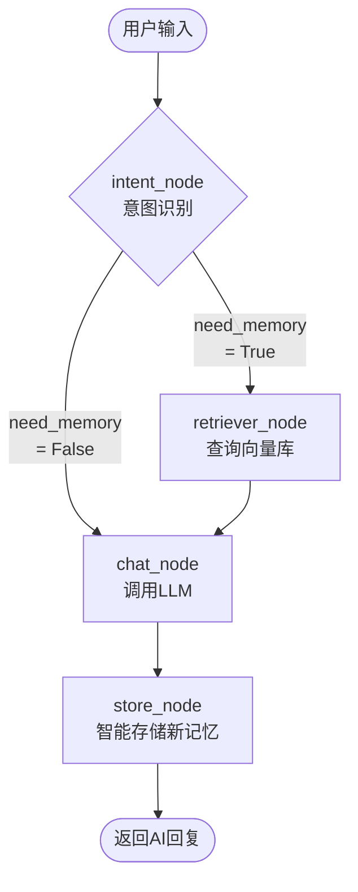

# 记忆框架技术文档

## 目录

- [1. 架构概览](#1-架构概览)
- [2. 核心组件](#2-核心组件)
  - [2.1 MemoryType 枚举](#21-memorytype-枚举)
  - [2.2 MemoryItem 数据结构](#22-memoryitem-数据结构)
  - [2.3 MemoryStore 向量存储](#23-memorystore-向量存储)
  - [2.4 MemoryManager 管理器](#24-memorymanager-管理器)
- [3. Graph 架构与意图识别](#3-graph-架构与意图识别)
  - [3.1 LangGraph v0.4 架构](#31-langgraph-v04-架构)
  - [3.2 意图识别两关卡机制](#32-意图识别两关卡机制)
  - [3.3 关键词列表](#33-关键词列表)
- [4. 数据流](#4-数据流)
  - [4.1 自动提取流程](#41-自动提取流程)
  - [4.2 查询流程](#42-查询流程)
  - [4.3 更新流程 (smart_store)](#43-更新流程-smart_store)
- [5. 技术实现细节](#5-技术实现细节)
  - [5.1 向量嵌入模型](#51-向量嵌入模型)
  - [5.2 相似度搜索算法](#52-相似度搜索算法)
  - [5.3 智能更新策略 (两阶段)](#53-智能更新策略-两阶段)
- [6. API 使用指南](#6-api-使用指南)
  - [6.1 基础 API](#61-基础-api)
  - [6.2 高级 API](#62-高级-api)
  - [6.3 HTTP API (Swagger)](#63-http-api-swagger)
- [7. 配置与调优](#7-配置与调优)
- [8. 常见问题](#8-常见问题)
- [9. 变更记录](#9-变更记录)

---

## 1. 架构概览

### 技术栈

| 组件           | 技术                  | 版本  | 说明                 |
| -------------- | --------------------- | ----- | -------------------- |
| 向量数据库     | ChromaDB              | 1.5.9 | 轻量级本地向量存储   |
| Embedding 模型 | bge-small-zh          | v1.5  | 中文向量嵌入，512 维 |
| 模型框架       | sentence-transformers | 2.x   | 加载和运行 Embedding |
| 数据序列化     | Pydantic              | 2.x   | 类型安全的数据模型   |

### 整体架构图

```
┌─────────────────────────────────────────────────────────────────┐
│                        记忆系统架构 (v0.4)                        │
├─────────────────────────────────────────────────────────────────┤
│                                                                   │
│  ┌─────────────────────────────────────────────────────────────┐ │
│  │ 应用层 (LangGraph)                                             │ │
│  │                                                               │ │
│  │  ┌───────────────┐                                            │ │
│  │  │  intent_node  │ ← 入口                                     │ │
│  │  │ (判断是否查询) │                                            │ │
│  │  └───────┬───────┘                                            │ │
│  │          │ need_memory?                                        │ │
│  │     ┌────┴────┐                                                │ │
│  │     ↓         ↓                                                │ │
│  │  ┌───────┐  ┌───────────────┐                                 │ │
│  │  │retrieve│  │   chat_node   │                                 │ │
│  │  │ (检索) │  │ (生成+提取)   │                                 │ │
│  │  └───┬───┘  └───────┬───────┘                                 │ │
│  │      │              │                                          │ │
│  │      └──────┬───────┘                                          │ │
│  │             ↓                                                  │ │
│  │       ┌───────────────┐                                        │ │
│  │       │   store_node  │ ← 记忆智能存储                        │ │
│  │       │ (关键词+LLM)  │                                        │ │
│  │       └───────┬───────┘                                        │ │
│  │               ↓                                                │ │
│  │             END                                                │ │
│  └─────────────────────────────────────────────────────────────┘ │
│                             │                                     │
│                             ↓                                     │
│  ┌─────────────────────────────────────────────────────────────┐ │
│  │ MemoryManager (单例)                                          │ │
│  │                                                               │ │
│  │  find_similar()  should_replace_keyword()  batch_add()        │ │
│  └──────────────────────────┬──────────────────────────────────┘ │
│                             │                                     │
│                             ↓                                     │
│  ┌─────────────────────────────────────────────────────────────┐ │
│  │ MemoryStore                                                   │ │
│  │                                                               │ │
│  │  ┌─────────────────────────────────────────────────────┐     │ │
│  │  │  ChromaDB Collection (user_memory)                    │     │ │
│  │  │                                                       │     │ │
│  │  │  Documents: ["用户叫王其乐", "用户喜欢编程", ...]      │     │ │
│  │  │  Metadata:  [{type: "fact", source: "llm_extract"},...]│     │ │
│  │  │  Embeddings: [[0.123, 0.456, ...], ...]  (512维)     │     │ │
│  │  └─────────────────────────────────────────────────────┘     │ │
│  └──────────────────────────┬──────────────────────────────────┘ │
│                             │                                     │
│                             ↓                                     │
│  ┌─────────────────────────────────────────────────────────────┐ │
│  │ 持久化存储                                                     │ │
│  │                                                               │ │
│  │  data/memory/                                                 │ │
│  │  ├── chroma.sqlite3          # SQLite 数据库                  │ │
│  │  └── 1df21c60-.../           # HNSW 索引目录                  │ │
│  │      └── ...                                                 │ │
│  └─────────────────────────────────────────────────────────────┘ │
│                                                                   │
└─────────────────────────────────────────────────────────────────┘
```

### 文件结构

```
warming_baby/
├── core/
│   └── long_memory_base.py      # 记忆框架核心实现（存储层）
│
├── agent/
│   └── chat/
│       ├── chat_schema.py       # 公共数据契约（ChatResponse, MemoryExtract, Emotion）
│       ├── state.py             # AgentState 状态定义
│       ├── graph.py             # LangGraph 编排
│       ├── chat_agent.py        # Agent 组装入口
│       └── nodes/               # 节点实现
│           ├── __init__.py
│           ├── intent.py        # 意图识别（含 IntentResult Pydantic 模型）
│           ├── retriever.py     # 记忆检索
│           ├── chat.py          # LLM 对话生成
│           └── store.py         # 记忆存储（含 DecisionResult Pydantic 模型）
│
├── models/
│   └── bge-small-zh-v1.5/       # Embedding 模型文件
│
├── data/
│   └── memory/                  # ChromaDB 数据目录
│       ├── chroma.sqlite3
│       └── ...
│
└── docs/
    └── 记忆框架技术文档.md       # 本文档
```

### Pydantic 模型分层原则

| 层级         | 位置             | 生命周期              | 示例                             |
| ------------ | ---------------- | --------------------- | -------------------------------- |
| **公共契约** | `chat_schema.py` | 跨节点/跨模块流转     | `ChatResponse`, `MemoryExtract`  |
| **节点内部** | 各 node 文件顶部 | 仅本节点 LLM 调用使用 | `IntentResult`, `DecisionResult` |

---

## 2. 核心组件

### 2.1 MemoryType 枚举

定义 5 种记忆类型，用于分类存储和检索：

```python
from enum import StrEnum

class MemoryType(StrEnum):
    """记忆类型枚举"""

    FACT = "fact"              # 事实: "我叫小明"、"我1990年生"
    PREFERENCE = "preference"  # 偏好: "我喜欢苹果"、"讨厌香菜"
    EVENT = "event"            # 事件: "昨天去公园"、"今天买了新电脑"
    CONTEXT = "context"        # 上下文: "最近在学PyTorch"、"刚看完这部剧"
    SKILL = "skill"            # 技能: "我会Python"、"会弹吉他"

# 使用示例
MemoryType.FACT           # 返回 "fact"
MemoryType.FACT.value     # 返回 "fact" (同上)
MemoryType.get_display_name(MemoryType.FACT)  # 返回 "事实"
```

### 2.2 MemoryItem 数据结构

单条记忆的完整数据模型：

```python
from dataclasses import dataclass, field
from typing import Dict, Any
import uuid
import time

@dataclass
class MemoryItem:
    """记忆项数据结构"""

    content: str                                           # 记忆内容 (必填)
    memory_type: MemoryType                                # 记忆类型 (必填)
    memory_id: str = field(default_factory=lambda: str(uuid.uuid4()))  # 唯一ID (自动生成)
    metadata: Dict[str, Any] = field(default_factory=dict)  # 扩展元数据
    created_at: float = field(default_factory=time.time)    # 创建时间戳
    updated_at: float = field(default_factory=time.time)    # 更新时间戳
    access_count: int = 0                                    # 被检索次数

# 使用示例
item = MemoryItem(
    content="用户叫王其乐",
    memory_type=MemoryType.FACT,
    metadata={"source": "llm_extract"}
)

# 转换为字典 (用于 ChromaDB)
item_dict = item.to_dict()
# {
#   "id": "3b893c37-...",
#   "content": "用户叫王其乐",
#   "type": "fact",
#   "metadata": {"source": "llm_extract"},
#   "created_at": 1725192821.0,
#   "updated_at": 1725192821.0,
#   "access_count": 0
# }
```

### 2.3 MemoryStore 向量存储

ChromaDB 的封装层，负责底层向量操作：

```python
class MemoryStore:
    """ChromaDB 向量存储封装"""

    def __init__(self, storage_path: str, model_path: str):
        """
        初始化向量存储

        Args:
            storage_path: ChromaDB 数据目录
            model_path: Embedding 模型目录
        """
        self._storage_path = storage_path
        self._model_path = model_path
        self._client = None       # ChromaDB Client
        self._collection = None   # 向量集合
        self._embedding_func = None  # Embedding 函数
        self._initialized = False

    def initialize(self) -> bool:
        """初始化 (加载模型、创建数据库)"""
        # 1. 加载 Embedding 模型
        self._embedding_func = SentenceTransformerEmbeddingFunction(
            model_name=self._model_path,
            device='cpu',
        )

        # 2. 创建 ChromaDB Client
        self._client = chromadb.PersistentClient(path=self._storage_path)

        # 3. 获取/创建集合
        self._collection = self._client.get_or_create_collection(
            name="user_memory",
            embedding_function=self._embedding_func,
            metadata={"hnsw:space": "cosine"},
        )
        return True

    def add(self, items: List[MemoryItem]) -> bool:
        """批量添加记忆"""
        self._collection.add(
            ids=[item.memory_id for item in items],
            documents=[item.content for item in items],
            metadatas=[
                {
                    "type": item.memory_type.value,
                    "created_at": item.created_at,
                    "updated_at": item.updated_at,
                    "access_count": item.access_count,
                    **item.metadata,
                }
                for item in items
            ],
        )

    def search(
        self,
        query: str,
        n_results: int = 5,
        memory_type: Optional[MemoryType] = None,
        min_score: float = 0.3
    ) -> List[Dict]:
        """语义搜索"""
        # ... (详见技术实现章节)

    def smart_add(self, items: List[MemoryItem], threshold: float = 0.5) -> bool:
        """智能添加 (自动替换同类旧记忆)"""
        # ... (详见技术实现章节)
```

### 2.4 MemoryManager 管理器

单例模式的统一入口，对外提供简洁 API：

```python
class MemoryManager:
    """长记忆管理器 (单例)"""

    _instance = None

    def __new__(cls, *args, **kwargs):
        if cls._instance is None:
            cls._instance = super().__new__(cls)
        return cls._instance

    def __init__(self, model_path: str, storage_path: str = None):
        # 防重复初始化
        if hasattr(self, '_initialized'):
            return
        self._store = MemoryStore(storage_path, model_path)

    @classmethod
    def get_instance(cls) -> "MemoryManager":
        """获取全局单例"""
        if cls._instance is None:
            cls._instance = cls()
        return cls._instance

# 全局便捷函数
manager = get_memory_manager()  # 获取单例
manager.initialize()            # 初始化

# 使用
manager.add_memory("用户叫王其乐", MemoryType.FACT)
results = manager.search("我叫什么名字")
```

---

## 3. Graph 架构与意图识别

### 3.1 LangGraph v0.4 架构



#### 节点说明

| 节点               | 文件                            | 功能                    | 耗时           |
| ------------------ | ------------------------------- | ----------------------- | -------------- |
| **intent_node**    | `agent/chat/nodes/intent.py`    | 判断是否需要查记忆      | <1ms 或 ~300ms |
| **retriever_node** | `agent/chat/nodes/retriever.py` | 向量相似度搜索          | ~50ms          |
| **chat_node**      | `agent/chat/nodes/chat.py`      | LLM 生成回复 + 提取记忆 | ~1-3s          |
| **store_node**     | `agent/chat/nodes/store.py`     | 智能存储（关键词+LLM）  | ~50-100ms      |

#### 数据流示例

**示例 1: 查询记忆 (路径 A)**

```
用户: "我叫什么名字"
  ↓
intent_node → 第一关命中关键词 "我叫" → need_memory=True
  ↓
retriever_node → 向量搜索 → "用户叫王其乐" (相似度 41%)
  ↓
chat_node → System Prompt 包含记忆 → AI 回复 "你是王其乐呀！"
  ↓
          → 提取到新记忆: [] (空)
  ↓
store_node → 无新记忆，跳过
```

**示例 2: 普通对话 + 新记忆 (路径 B)**

```
用户: "我叫小明"
  ↓
intent_node → 第一关未命中，第二关 LLM 判断 → need_memory=False
  ↓
retriever_node → 跳过
  ↓
chat_node → 直接调用 LLM → AI 回复 "好的~小明~"
  ↓
          → 提取到新记忆: [MemoryExtract(content="用户叫小明", type="fact")]
  ↓
store_node → 发现新记忆
          → find_similar() → 无相似记忆
          → batch_add() → 成功添加
```

### 3.2 意图识别两关卡机制

```
┌─────────────────────────────────────────────────────────────────────┐
│ intent_node 流程                                                     │
├─────────────────────────────────────────────────────────────────────┤
│                                                                      │
│  输入: user_input = "我有多高"                                       │
│    │                                                                 │
│    ▼                                                                 │
│  ┌────────────────────────────────────────────────────────────────┐ │
│  │ 第一关: _quick_intent_check (关键词匹配)                         │ │
│  │                                                                  │ │
│  │  if "身高" in user_input → True (直接返回)                      │ │
│  │  if "我叫" in user_input → True (直接返回)                      │ │
│  │  if "记得" in user_input → True (直接返回)                      │ │
│  │  ...                                                             │ │
│  │                                                                  │ │
│  │  耗时: <1ms                                                      │ │
│  │  优点: 零延迟，精确命中                                          │ │
│  └────────────────────────────────────────────────────────────────┘ │
│    │                                                                 │
│    ├── True → 返回 need_memory=True                                 │
│    │                                                                 │
│    └── False → 进入第二关                                           │
│          │                                                           │
│          ▼                                                           │
│  ┌────────────────────────────────────────────────────────────────┐ │
│  │ 第二关: _llm_intent_check (LLM 判断)                             │ │
│  │                                                                  │ │
│  │  Prompt:                                                         │ │
│  │  "判断用户是否在问关于自己的信息，返回 True/False"                 │ │
│  │                                                                  │ │
│  │  用户: "我之前提到过吗" → True                                   │ │
│  │  用户: "你好"           → False                                   │ │
│  │                                                                  │ │
│  │  耗时: ~300ms                                                    │ │
│  │  优点: 处理模糊意图                                              │ │
│  │  容错: 异常时返回 False                                          │ │
│  └────────────────────────────────────────────────────────────────┘ │
│    │                                                                 │
│    ▼                                                                 │
│  返回 need_memory: True/False                                       │
│                                                                      │
└─────────────────────────────────────────────────────────────────────┘
```

### 3.3 关键词列表

**代码位置**: `agent/chat/nodes/intent.py:20-55`

| 分类         | 关键词                                   | 示例             |
| ------------ | ---------------------------------------- | ---------------- |
| **名字**     | 我叫、我的名字、我是谁、你知道我、认识我 | "我是谁"         |
| **身体**     | 身高、体重、多高、多重                   | "我有多高"       |
| **年龄**     | 年龄、生日、多少岁、多大、几岁           | "我几岁"         |
| **偏好**     | 我喜欢、我爱吃、我讨厌、我不喜欢         | "我喜欢吃什么"   |
| **技能**     | 我会、我能                               | "我会什么"       |
| **过去**     | 我之前、我以前、上次、之前说             | "我之前说过什么" |
| **记忆唤醒** | 记得我、记得你、还记得、记不记得         | "你记得我吗"     |

---

## 4. 数据流

### 4.1 自动提取流程

用户说"我叫王其乐"后，系统自动保存记忆：

```
用户输入: "我叫王其乐"
    │
    ↓
┌─────────────────────────────────────────────────────────────┐
│ Step 1: chat_node 返回结构化响应                              │
├─────────────────────────────────────────────────────────────┤
│ state["response"] = ChatResponse {                           │
│   text: "好的~王其乐~嘿嘿",                                    │
│   emotion: "happy",                                           │
│   new_memories: [                                             │
│     MemoryExtract {                                           │
│       content: "用户叫王其乐",                                │
│       memory_type: "fact"                                     │
│     }                                                         │
│   ]                                                           │
│ }                                                             │
│ state["new_memories"] = [...]  # 传递给下一个节点              │
└─────────────────────────────┬───────────────────────────────┘
                                │
                                ↓
┌─────────────────────────────────────────────────────────────┐
│ Step 2: store_node 接收 new_memories                          │
├─────────────────────────────────────────────────────────────┤
│ memories = state.get("new_memories", [])                     │
│ if not memories:                                             │
│     return {"memory_save_result": "skipped"}                 │
│                                                               │
│ # 构建 MemoryItem 列表                                        │
│ items = [MemoryItem(...) for mem in memories]                 │
└─────────────────────────────┬───────────────────────────────┘
                                │
                                ↓
┌─────────────────────────────────────────────────────────────┐
│ Step 3: smart_store 智能存储                                  │
├─────────────────────────────────────────────────────────────┤
│ for item in items:                                            │
│   # 1. 查找相似记忆                                           │
│   similar = find_similar(item.content, item.memory_type)     │
│                                                               │
│   if similar:                                                │
│     for old in similar:                                       │
│       # 2. 关键词判断（快速）                                  │
│       if should_replace_keyword(old, new):                   │
│         mark_for_delete(old.id)                              │
│       elif use_llm:                                          │
│         # 3. LLM 判断（兜底）                                  │
│         decision = judge_replace_with_llm(old, new)          │
│         if decision == "replace":                             │
│           mark_for_delete(old.id)                            │
│                                                               │
│   # 4. 执行删除和添加                                          │
│   if old_ids_to_delete:                                      │
│     delete_by_ids(old_ids_to_delete)                         │
│   batch_add(items_to_add)                                    │
└─────────────────────────────┬───────────────────────────────┘
                                │
                                ↓
┌─────────────────────────────────────────────────────────────┐
│ Step 4: 返回存储结果                                          │
├─────────────────────────────────────────────────────────────┤
│ return {                                                      │
│   "memory_save_result": {                                    │
│     "status": "success",                                     │
│     "count": 1                                               │
│   }                                                           │
│ }                                                             │
└─────────────────────────────────────────────────────────────┘
```

**关键特性：**

- store_node 是 LangGraph 的同步节点，不阻塞主流程
- 存储失败不影响对话响应（只记录日志）
- 支持两阶段判断：关键词（快速）→ LLM（兜底）

### 4.2 查询流程

用户问"我叫什么名字"时的检索流程：

```
用户输入: "我叫什么名字"
    │
    ↓
┌─────────────────────────────────────────────────────────────┐
│ Step 1: intent_node 判断是否需要查询                           │
├─────────────────────────────────────────────────────────────┤
│ _quick_intent_check("我叫什么名字")                           │
│ → 包含关键词 "我叫" → return True                              │
└─────────────────────────────┬───────────────────────────────┘
                                │
                                ↓
┌─────────────────────────────────────────────────────────────┐
│ Step 2: retriever_node 执行检索                                │
├─────────────────────────────────────────────────────────────┤
│ if not state["need_memory"]:                                  │
│     return {"memory_context": ""}  # 跳过                    │
│                                                               │
│ memory_text = mem_mgr.get_relevant_memories(                  │
│     "我叫什么名字", max_items=3                               │
│ )                                                             │
└─────────────────────────────┬───────────────────────────────┘
                                │
                                ↓
┌─────────────────────────────────────────────────────────────┐
│ Step 3: 注入记忆到 context                                     │
├─────────────────────────────────────────────────────────────┤
│ state["memory_context"] = "- [fact] (置信度 87%) 用户叫王其乐" │
│                                                               │
│ # 传递给下一个节点 (chat_node)                                 │
└─────────────────────────────┬───────────────────────────────┘
                                │
                                ↓
┌─────────────────────────────────────────────────────────────┐
│ Step 4: chat_node 使用记忆生成响应                              │
├─────────────────────────────────────────────────────────────┤
│ system_prompt = create_system_prompt(time_info)               │
│ if memory_context:                                            │
│     system_prompt += f"\n\n【你对用户的记忆】\n{memory_text}"  │
│                                                               │
│ # LLM 看到完整上下文:                                          │
│ "你对用户的记忆: 用户叫王其乐"                                 │
│                                                               │
│ # 生成更个性化的响应:                                          │
│ "你叫王其乐呀~我记得呢~"                                       │
└─────────────────────────────────────────────────────────────┘
```

### 4.3 更新流程 (smart_store)

用户修改名字时自动替换旧记忆，采用两阶段判断：

```
用户先叫"小明"，后改为"王其乐"
    │
    ↓
┌─────────────────────────────────────────────────────────────┐
│ Step 1: 查找相似记忆                                           │
├─────────────────────────────────────────────────────────────┤
│ 新记忆: {content: "用户叫王其乐", memory_type: "fact"}         │
│                                                               │
│ similar = mem_mgr.find_similar(                               │
│     query="用户叫王其乐",                                     │
│     memory_type="fact",                                      │
│     n_results=3,                                             │
│     min_score=0.5                                            │
│ )                                                             │
│                                                               │
│ # 返回:                                                       │
│ [                                                             │
│   {                                                           │
│     id: "xxx-123",                                            │
│     content: "用户叫小明",                                    │
│     score: 0.72,  # > 0.5 阈值                                │
│   }                                                           │
│ ]                                                             │
└─────────────────────────────────────────────────────────────┘
                                │
                                ↓
┌─────────────────────────────────────────────────────────────┐
│ Step 2: 两阶段判断是否替换                                     │
├─────────────────────────────────────────────────────────────┤
│ 第一阶段: 关键词判断 (should_replace_keyword)                 │
│                                                               │
│ - 对 preference 类型，提取(方向, 核心内容)                    │
│ - 核心内容相同 → 替换                                         │
│   old: "用户喜欢苹果" (核心: "苹果")                          │
│   new: "用户讨厌苹果" (核心: "苹果") → 替换 ✓                 │
│ - 核心内容不同 → 保留，进入第二阶段                           │
│                                                               │
│ 第二阶段: LLM 判断 (judge_replace_with_llm)                  │
│                                                               │
│ # 构造 Prompt:                                                │
│ "判断以下两条记忆的关系:                                      │
│  旧记忆: 用户叫小明                                           │
│  新记忆: 用户叫王其乐                                         │
│  可选: replace / keep_both / keep_old"                        │
│                                                               │
│ # LLM 返回: DecisionResult(decision="replace")               │
└─────────────────────────────────────────────────────────────┘
                                │
                                ↓
┌─────────────────────────────────────────────────────────────┐
│ Step 3: 执行替换                                               │
├─────────────────────────────────────────────────────────────┤
│ old_ids_to_replace = ["xxx-123"]                              │
│                                                               │
│ if old_ids_to_replace:                                        │
│     mem_mgr.delete_by_ids(old_ids_to_replace)                 │
│                                                               │
│ mem_mgr.batch_add([new_item])                                 │
└─────────────────────────────────────────────────────────────┘
                                │
                                ↓
┌─────────────────────────────────────────────────────────────┐
│ 结果                                                           │
├─────────────────────────────────────────────────────────────┤
│ 删除前: [用户叫小明]                                          │
│ 删除后: [用户叫王其乐]  ← 只保留最新的                        │
└─────────────────────────────────────────────────────────────┘
```

**两阶段判断的优势：**

- 关键词判断：快速（<1ms），处理明确的替换场景
- LLM 判断：灵活（~300ms），处理模糊的替换场景
- 兜底策略：LLM 失败时默认 `keep_both`，不会丢失记忆

---

## 5. 技术实现细节

### 5.1 向量嵌入模型

**模型选择**: bge-small-zh-v1.5

| 属性     | 值       |
| -------- | -------- |
| 模型大小 | ~100MB   |
| 输出维度 | 512      |
| 语言支持 | 中文优化 |
| 推理设备 | CPU      |

**为什么选它?**

- 轻量级，适合桌面应用
- 中文语义理解好（比通用模型更准确）
- 本地运行，无需网络调用

**加载方式**:

```python
from chromadb.utils import embedding_functions

embedding_func = embedding_functions.SentenceTransformerEmbeddingFunction(
    model_name="./models/bge-small-zh-v1.5",
    device='cpu',
)

# 首次加载 ~2-3秒
# 后续加载 <0.5秒
```

### 5.2 相似度搜索算法

**使用的距离度量**: 余弦距离 (Cosine Distance)

```python
# ChromaDB 初始化配置
self._collection = self._client.get_or_create_collection(
    name="user_memory",
    embedding_function=self._embedding_func,
    metadata={"hnsw:space": "cosine"},  # 使用余弦距离
)
```

**相似度计算公式**:

```
余弦相似度 = 1 - 余弦距离
相似度范围: [0, 1]
- 0.8+: 非常相关
- 0.6-0.8: 较强相关
- 0.4-0.6: 中等相关
- < 0.4: 弱相关
```

**搜索流程**:

```python
def search(self, query, n_results, memory_type, min_score):
    # 1. Embedding
    query_embedding = self._embedding_func([query])[0]

    # 2. 向量搜索
    results = self._collection.query(
        query_embeddings=[query_embedding],
        n_results=n_results,
        where={"type": memory_type} if memory_type else None,  # 类型过滤
    )

    # 3. 计算相似度
    memories = []
    for doc, dist in zip(results.documents, results.distances):
        similarity = 1 - dist  # 距离 → 相似度
        if similarity >= min_score:
            memories.append({
                "id": results.ids[i],
                "content": doc,
                "similarity": similarity,
                "metadata": results.metadatas[i],
            })

    return memories
```

### 5.3 智能更新策略 (两阶段)

**核心思想**: 快速判断 + LLM 兜底，实现智能的记忆替换

```python
def smart_store(self, items, llm=None):
    """
    智能存储：两阶段判断是否替换旧记忆

    第一阶段: 关键词匹配 (快速)
    - 针对 preference 类型，提取(方向, 核心内容)
    - 核心内容相同 → 替换

    第二阶段: LLM 判断 (灵活)
    - 当关键词无法确定时，使用 LLM 判断
    - 可选: replace / keep_both / keep_old

    Args:
        items: 新记忆列表
        llm: LLM 实例 (用于第二阶段)
    """
    for item in items:
        # Step 1: 查找相似记忆
        similar = self.find_similar(
            query=item.content,
            memory_type=item.memory_type,
            n_results=3,
        )

        old_ids_to_replace = []

        for old in similar:
            # Step 2: 第一阶段 - 关键词判断
            should_replace = self.should_replace_keyword(
                old_item=old,
                new_item=item
            )

            if should_replace == True:
                old_ids_to_replace.append(old['id'])
                continue

            # Step 3: 第二阶段 - LLM 判断
            if llm and should_replace == 'uncertain':
                decision = self.judge_replace_with_llm(
                    old_content=old['content'],
                    new_content=item.content,
                    memory_type=item.memory_type,
                    llm=llm,
                )
                if decision == 'replace':
                    old_ids_to_replace.append(old['id'])

        # Step 4: 执行操作
        if old_ids_to_replace:
            self.delete_by_ids(old_ids_to_replace)

    self.batch_add(items)
```

**关键方法**:

| 方法                       | 功能         | 耗时   |
| -------------------------- | ------------ | ------ |
| `find_similar()`           | 查找相似记忆 | ~50ms  |
| `should_replace_keyword()` | 关键词判断   | <1ms   |
| `judge_replace_with_llm()` | LLM 判断     | ~300ms |
| `batch_add()`              | 批量添加     | ~10ms  |

**判断逻辑示例**:

```
场景: 用户修改偏好
  old: "用户喜欢吃苹果"
  new: "用户讨厌吃苹果"

  Step 1: 关键词判断
    - 提取方向: 喜欢 vs 讨厌
    - 提取核心: 吃苹果 vs 吃苹果
    - 核心相同 → should_replace = True
    - 结果: 替换 ✓

场景: 用户说不同的偏好
  old: "用户喜欢吃苹果"
  new: "用户喜欢吃香蕉"

  Step 1: 关键词判断
    - 提取方向: 喜欢 vs 喜欢
    - 提取核心: 吃苹果 vs 吃香蕉
    - 核心不同 → should_replace = False
    - 结果: 保留两个 ✓

场景: 模糊判断 (交给 LLM)
  old: "用户在杭州工作"
  new: "用户搬到了上海"

  Step 1: 关键词判断 → uncertain
  Step 2: LLM 判断 → replace
  结果: 替换 ✓
```

---

## 6. API 使用指南

### 6.1 基础 API

```python
from core.long_memory_base import (
    MemoryManager,
    MemoryType,
    MemoryItem,
    get_memory_manager,
)

# ========== 初始化 ==========
manager = get_memory_manager()  # 获取单例
manager.initialize()            # 加载模型 (~2秒)

# ========== 添加记忆 ==========
# 方式1: 单条添加
manager.add_memory(
    content="用户叫王其乐",
    memory_type=MemoryType.FACT,
)

# 方式2: 批量添加
manager.add_memories([
    MemoryItem(content="用户喜欢Python", memory_type=MemoryType.PREFERENCE),
    MemoryItem(content="用户讨厌香菜", memory_type=MemoryType.PREFERENCE),
])

# 方式3: 智能添加 (推荐!)
manager.smart_add_memories([
    MemoryItem(content="用户叫小明", memory_type=MemoryType.FACT),
])
# 然后修改
manager.smart_add_memories([
    MemoryItem(content="用户叫王其乐", memory_type=MemoryType.FACT),
])
# 自动替换旧记忆

# ========== 查询记忆 ==========
# 方式1: 语义搜索
results = manager.search(
    query="我叫什么名字",
    n_results=3,
    memory_type=MemoryType.FACT,  # 可选过滤
    min_score=0.4,
)
for r in results:
    print(f"{r['content']} (相似度: {r['similarity']:.2%})")

# 方式2: 获取全部
all_mem = manager.get_all_memories()

# 方式3: 按类型过滤
facts = manager.get_all_memories(memory_type=MemoryType.FACT)

# 方式4: 格式化输出 (给LLM用)
memory_text = manager.get_relevant_memories("我叫什么")
# 输出: "- [fact] (置信度 87%) 用户叫王其乐"

# ========== 删除记忆 ==========
manager.delete_memory(memory_id="3b893c37-...")

# ========== 统计 ==========
stats = manager.get_memory_stats()
# {"total": 5, "by_type": {"fact": 3, "preference": 2}}

# ========== 清空 ==========
manager.clear_all()
```

### 6.2 高级 API

```python
from core.long_memory_base import get_memory_manager, MemoryType

manager = get_memory_manager()

# ========== 条件过滤 ==========
# 按时间范围
recent = manager.search(
    query="什么",
    min_score=0.3,
)
# (需要自行扩展 metadata 过滤)

# ========== 自定义元数据 ==========
item = MemoryItem(
    content="用户在杭州",
    memory_type=MemoryType.FACT,
    metadata={
        "source": "chat",          # 来源
        "confidence": 0.9,         # 置信度
        "tags": ["location"],      # 标签
    }
)
manager.add_memories([item])

# ========== 获取原始数据 ==========
raw = manager.get_all_memories()
# 每条包含: id, content, metadata, similarity
```

### 6.3 HTTP API (Swagger)

启动 ChromaDB Server:

```bash
chroma run \
  --host localhost \
  --port 8005 \
  --path data/memory
```

打开 Swagger: http://localhost:8005/docs

#### 常用 API 端点

| 功能                | Method | Path                                                              |
| ------------------- | ------ | ----------------------------------------------------------------- |
| 查看所有 Collection | GET    | `/api/v2/tenants/{tenant}/databases/{db}/collections`             |
| 获取数据            | POST   | `/api/v2/tenants/{tenant}/databases/{db}/collections/{id}/get`    |
| 语义搜索            | POST   | `/api/v2/tenants/{tenant}/databases/{db}/collections/{id}/query`  |
| 添加数据            | POST   | `/api/v2/tenants/{tenant}/databases/{db}/collections/{id}/add`    |
| 删除数据            | POST   | `/api/v2/tenants/{tenant}/databases/{db}/collections/{id}/delete` |

#### 请求示例

**获取数据**:

```json
POST /api/v2/tenants/default_tenant/databases/default_database/collections/2ce28e1f-.../get
{
  "limit": 100,
  "where": {"type": "fact"},
  "include": ["metadatas", "documents"]
}
```

**语义搜索**:

```json
POST /api/v2/tenants/default_tenant/databases/default_database/collections/2ce28e1f-.../query
{
  "query_texts": ["我叫什么名字"],
  "n_results": 5,
  "include": ["metadatas", "documents", "distances"]
}
```

---

## 7. 配置与调优

### 7.1 Embedding 模型缓存

首次加载模型较慢（~2秒），建议预热：

```python
# 在应用启动时异步预热
import threading

def warmup_memory():
    manager = get_memory_manager()
    manager.initialize()
    logger.info("[Memory] 预热完成")

# 后台线程启动
threading.Thread(target=warmup_memory, daemon=True).start()
```

### 7.2 相似度阈值调优

不同场景的推荐阈值：

| 场景               | 阈值 | 说明             |
| ------------------ | ---- | ---------------- |
| 记忆更新（改名字） | 0.5  | 自动替换同类记忆 |
| 记忆查询（推荐）   | 0.3  | 召回更多相关结果 |
| 精确搜索           | 0.7  | 只返回高度相关的 |

### 7.3 性能优化

**启动时间**:

- 首次加载模型: ~2-3秒
- 后续加载: <0.5秒
- 建议: 异步预热，不阻塞 UI

**查询延迟**:

- 本地 Embedding: ~50ms
- ChromaDB 搜索: ~20ms
- 总计: ~70ms

**存储规模**:

- 单条记忆: < 1KB (embedding + metadata)
- 1GB 存储: ~100万条记忆
- 实际应用: 远不到这个规模

### 7.4 备份与恢复

```python
# 简单备份: 复制整个目录
import shutil

def backup_memory(backup_path):
    manager = get_memory_manager()
    manager._store._client.persist()  # 确保落盘
    shutil.copytree("data/memory", backup_path)

# 恢复: 覆盖目录后重启应用
```

---

## 8. 常见问题

### Q1: 启动时 Embedding 模型加载慢怎么办?

**A**: 使用异步预热。

```python
import threading
from core.long_memory_base import get_memory_manager

def _warmup():
    manager = get_memory_manager()
    if not manager.is_ready:
        manager.initialize()
        logger.info("[Memory] 预热完成")

threading.Thread(target=_warmup, daemon=True).start()
```

### Q2: 如何清空所有记忆?

```python
manager.clear_all()
# 或者直接删除文件
# rm -rf data/memory/*
```

### Q3: 修改记忆内容怎么办?

用 `smart_add_memories` 会自动替换同类记忆：

```python
# 用户改名字
manager.smart_add_memories([
    MemoryItem(content="用户叫王其乐", memory_type=MemoryType.FACT),
], similarity_threshold=0.5)

# 旧的 "用户叫小明" 会被自动删除
```

### Q4: 如何在 Swagger 里看到数据?

```bash
# 1. 启动 Server
/Users/yangchengwei/.local/bin/chroma run \
  --host localhost --port 8005 \
  --path data/memory

# 2. 打开 Swagger
# http://localhost:8005/docs

# 3. 常用参数
# tenant: default_tenant
# database: default_database
# collection_id: 从 collections API 获取
```

### Q5: 记忆存到哪里了?

```
data/memory/
├── chroma.sqlite3           # SQLite 元数据 (ID、文档、metadata)
├── 1df21c60-.../            # HNSW 向量索引目录
│   └── ...
└── ...
```

### Q6: 如何导入/导出记忆?

```python
# 导出
all_mem = manager.get_all_memories()
import json
with open("memories.json", "w") as f:
    json.dump(all_mem, f, ensure_ascii=False, indent=2)

# 导入
with open("memories.json", "r") as f:
    data = json.load(f)

items = [MemoryItem(
    content=d["content"],
    memory_type=MemoryType(d["metadata"]["type"]),
    metadata=d["metadata"],
) for d in data]
manager.smart_add_memories(items)
```

### Q7: 多进程使用安全吗?

**A**: ChromaDB 是线程安全的，但**不支持多进程**。

```python
# ✅ 正确: 单进程内多线程
threading.Thread(target=save_memory).start()

# ❌ 错误: 多进程写入
multiprocessing.Process(target=save_memory).start()
```

---

## 9. 变更记录

### 9.1 v1.4 (2026-08-02)

**架构更新**：

- 🔄 Graph 架构升级到 v0.4：`intent → (retriever →) chat → store → END`
- 📦 新增 `store_node`：负责记忆的智能存储（两阶段判断）
- 📝 更新数据流说明，反映实际的 4 节点架构

**实现优化**：

- ✅ 实现两阶段记忆更新：关键词判断（快速）+ LLM 判断（兜底）
- ✅ 新增 `find_similar()`、`should_replace_keyword()`、`judge_replace_with_llm()` 方法
- ✅ 优化 `preference` 类型的替换逻辑（提取方向+核心内容）

**文档同步**：

- 📋 更新架构图、Graph 流程图、数据流说明
- 📋 更新 4.3 更新流程（smart_add → smart_store）
- 📋 更新 5.3 智能更新策略（单阶段 → 两阶段）

### 9.2 v1.3 (2026-08-02)

**架构优化**：

- 🔄 将单体 `node.py` 拆分为 `nodes/` 目录，按职责分离：
  - `intent.py`：意图识别
  - `retriever.py`：记忆检索
  - `chat.py`：LLM 对话
  - `store.py`：记忆存储
- 📝 明确 Pydantic 模型分层原则：公共契约放 `chat_schema.py`，节点内部模型就地定义
- ♻️ 将 `IntentResult` 从函数内部提升到模块顶层（[intent.py:15-17](file:///Users/yangchengwei/Documents/workspace/github_workspace/my_baby/warming_baby/agent/chat/nodes/intent.py#L15-L17)），与 `DecisionResult` 保持一致风格

### 9.3 v1.2 (2026-08-02)

**新增功能**：

- ✅ 实现完整的两关卡意图识别机制（关键词 + LLM 兜底）
- ✅ 新增 Graph 架构章节，详细说明节点和数据流
- ✅ 扩展关键词列表，支持身高、体重、年龄等属性查询

**Bug 修复**：

- 🔧 修复 `get_all()` 方法遗漏 `id` 字段的问题（[long_memory_base.py:532-542](file:///Users/yangchengwei/Documents/workspace/github_workspace/my_baby/warming_baby/core/long_memory_base.py#L532-L542)）
- 🔧 将 `get_relevant_memories()` 默认阈值从 0.4 降低到 0.3，提升召回率（[long_memory_base.py:879](file:///Users/yangchengwei/Documents/workspace/github_workspace/my_baby/warming_baby/core/long_memory_base.py#L879)）

### 9.4 v1.1 (2026-08-02)

**新增功能**：

- ✅ 智能去重和更新（smart_add）
- ✅ 支持查询的向量存储可视化（Swagger UI）

### 9.5 v1.0 (2026-08-02)

**初始版本**：

- 🎉 完成基础记忆框架
- 🎉 实现向量搜索和语义匹配

---

## 附录

### A. 记忆提取规则 (System Prompt)

```
记忆提取指南:
你需要判断用户是否透露了值得记住的个人信息。
如果有，在 new_memories 里列出；如果没有，返回空列表。

提取规则:
- fact: 用户陈述的客观事实（姓名、年龄、职业、生日、住址等）
- preference: 用户表达的喜好/厌恶（喜欢什么、讨厌什么）
- event: 用户分享的经历（今天做了什么、去过哪里等）
- context: 当前话题（正在讨论什么技术、看了什么视频等）
- skill: 用户具备的能力/特长

注意:
- 只提取用户明确说出的，不要猜测
- 一次最多提取 3 条，选最重要的
- 不要提取临时情绪（如"我好难过"），除非是长期性格倾向
- 不要提取通用常识（如"Python 是解释型语言"）
```

### B. 相关文件

| 文件                                                | 说明                       |
| --------------------------------------------------- | -------------------------- |
| [long_memory_base.py](core/long_memory_base.py)     | 记忆框架核心实现（存储层） |
| [chat_schema.py](agent/chat/chat_schema.py)         | 公共数据契约               |
| [state.py](agent/chat/state.py)                     | AgentState 状态定义        |
| [graph.py](agent/chat/graph.py)                     | LangGraph 编排             |
| [nodes/intent.py](agent/chat/nodes/intent.py)       | 意图识别节点               |
| [nodes/retriever.py](agent/chat/nodes/retriever.py) | 记忆检索节点               |
| [nodes/chat.py](agent/chat/nodes/chat.py)           | LLM 对话节点               |
| [nodes/store.py](agent/chat/nodes/store.py)         | 记忆存储节点               |

### C. 版本历史

| 版本 | 日期       | 更新内容                             |
| ---- | ---------- | ------------------------------------ |
| v1.4 | 2026-08-02 | Graph v0.4、两阶段存储、文档全面同步 |
| v1.3 | 2026-08-02 | 节点拆分、Pydantic模型分层           |
| v1.2 | 2026-08-02 | 两关卡意图识别、修复id字段           |
| v1.1 | 2026-08-02 | 智能去重、Swagger可视化              |
| v1.0 | 2026-08-02 | 基础记忆框架                         |

---

**文档版本**: v1.4  
**最后更新**: 2026-08-02

---

## D. 文档信息

**文档版本**: v1.3  
**最后更新**: 2026-08-02
